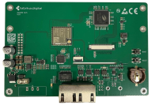
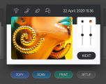
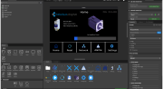

Step HMI offers a modern and cost-effective solution for simple automation tasks — a control system based on the ESP32-P4 microcontroller that combines performance, flexibility, and visualization in a single device. This system is an ideal alternative to traditional PLC + HMI combinations, significantly reducing costs and simplifying installation.The device integrates a touchscreen display that enables visualization and parameter configuration directly on the device. With support for CAN, RS485, Ethernet, and WiFi communication interfaces, it is ready for integration into a wide range of industrial applications. Although the device does not include built-in digital or analog inputs and outputs, it offers high flexibility through external I/O expansion cards, which can be connected similarly to conventional PLC systems. This ensures maximum modularity without compromise.

## Support open-source Graphics Library-LVGL
LVGL (Light and Versatile Graphics Library) is a powerful graphics library that enables the creation of advanced visual interfaces on various hardware platforms. It supports a wide range of features, including transition effects, widgets, custom component creation, touchscreen support, and dynamic screen resolution adjustment.

## Design and build UIs with ease with SquareLine Studio
This tool allows you to intuitively design the interface using drag-and-drop widgets and then export code that can be directly used in an embedded application. It speeds up the creation of visualizations and enables quick modifications without programming.

## Features
### Ethernet
Protocol support: TCP, UDP, IPv4, ICMP, ARP, IGMP, PPPoE
Data transfer rate up to 100 Mbps
Integrated 32 KB packet buffer

  

  

